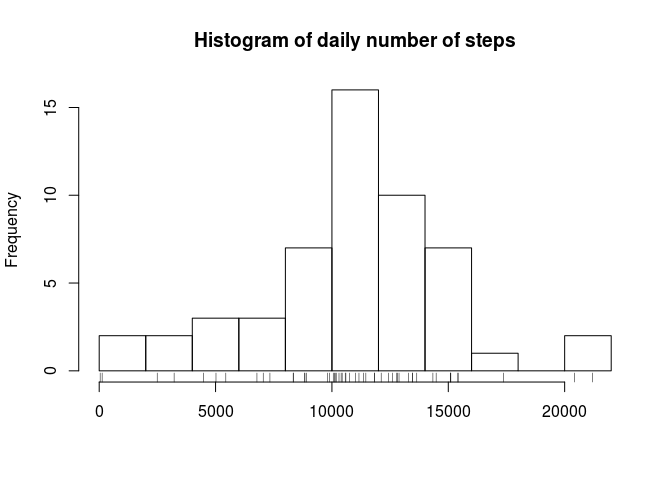
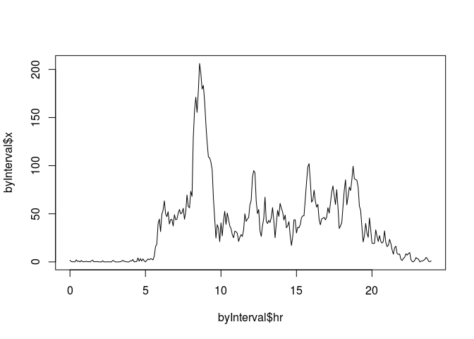
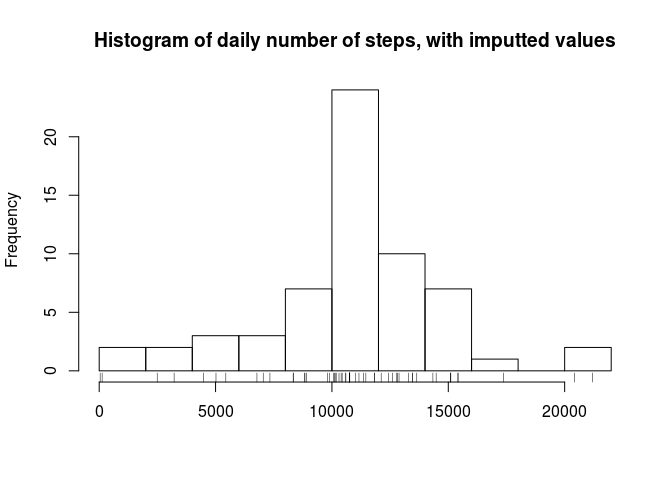
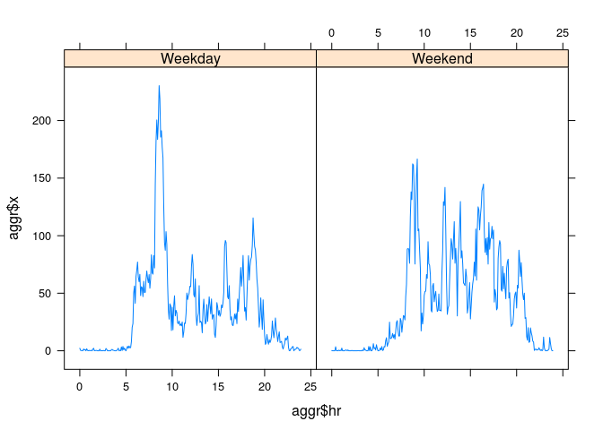

# Reproducible Research: Peer Assessment 1


## Loading and preprocessing the data

I assume the activity.zip file has been uncompressed into the current working 
directory.


```r
dOrig <- read.csv("activity.csv")
```


## What is mean total number of steps taken per day?

For this part of the task, I drop the entries with NA number of steps.


```r
d <- subset(dOrig, !is.na(dOrig$steps))
```

We aggregate the number of steps by day.


```r
daily <- aggregate(d$steps, by=list(d$date), FUN=sum)
```

Now we have all data we need to analyze the mean number of steps per day.
The mean number is 10766.189,
the median is 10765.

```
summary(daily$x)
```

Curiously they're very close to each other (within 
0.011%).
See the histogram below for a more detailed view:


```r
hist(daily$x, breaks=10,
     main = "Histogram of daily number of steps",
     xlab = "")
rug(daily$x)
```

 

## What is the average daily activity pattern?

To find this, we compute the average number of steps per interval using the function
`aggregate`.

For plotting I also do a small modification to the x axis data. Notice that 
the interval numbers encode the time as HHMM (e.g. 530 for 5:30). If we use 
numbers in this format directly as the x axis position, the last 5 minutes 
of an hour get a disproportionately wide interval. To neutralize this effect, 
I convert this to continuous time in hours (e.g. 5.5).


```r
byInterval <- aggregate(d$steps, by=list(d$interval), FUN=mean)
byInterval$hr <- byInterval$Group.1 %/% 100 + byInterval$Group.1%%100 / 60
plot(byInterval$hr, byInterval$x, type="l")
```

 

The maximum average number of steps (206.17) is attained
at the interval 835:


```r
max(byInterval$x)
```

```
## [1] 206
```

```r
byInterval$Group.1[which.max(byInterval$x)]
```

```
## [1] 835
```


## Imputing missing values

In the whole dataset there are 2304 incomplete 
data entries, that is, 13.115% of
the whole dataset.


```r
sum(!complete.cases(dOrig))
```

```
## [1] 2304
```

```r
sum(!complete.cases(dOrig))/nrow(dOrig)*100
```

```
## [1] 13.1
```

Let us fill in the missing values by the mean of the available values
per the corresponding 5-minute interval. We already have those computed
in `byInterval` from before. First we join the tables using the R function
`merge` and then we copy in the missing values.


```r
dImp <- merge(dOrig, byInterval, by.x = "interval", by.y = "Group.1", sort = F)
dImp$steps[is.na(dImp$steps)] <- dImp$x[is.na(dImp$steps)]
```

Now we compute the daily statistics in the same manner as above,
just using the imputted data. We see that the data statistics are almost the 
same as for the nonimputted data set.


```r
iDaily <- aggregate(dImp$steps, by=list(dImp$date), FUN=sum)
summary(iDaily$x)
```

```
##    Min. 1st Qu.  Median    Mean 3rd Qu.    Max. 
##      41    9820   10800   10800   12800   21200
```

```r
hist(iDaily$x, breaks=10,
     main = "Histogram of daily number of steps, with imputted values",
     xlab = "")
rug(iDaily$x)
```

 

## Are there differences in activity patterns between weekdays and weekends?

In this last part we first define a factor column determining whether
the value corresponds to a working day or a weekend.


```r
dImp$weekday <- weekdays(strptime(dImp$date, format="%Y-%m-%d"))
dImp$weekend <- dImp$weekday %in% c("Saturday", "Sunday")
dImp$type <- "Weekday"
dImp$type[dImp$weekend] <- "Weekend"
dImp$type <- factor(dImp$type)
```

Now we plot the values again using the `aggregate` function and the same trick 
to fix the spacing on the x axis as before.


```r
aggr <- aggregate(dImp$steps, by=list(dImp$interval, dImp$type), FUN=mean)
aggr$hr <- aggr$Group.1 %/% 100 + aggr$Group.1%%100 / 60

library(lattice)
xyplot(aggr$x ~ aggr$hr | aggr$Group.2, type="l")
```

 

We see that the typical pattern is indeed different. On a typical weekend,
the user's activity starts later and is generally higher over the day,
while during a typical working day, there's a strong peak of >200 steps
per 5 min interval but then the activity is milder.

